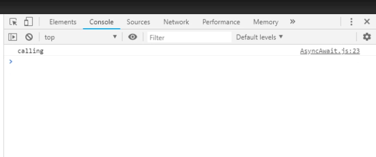
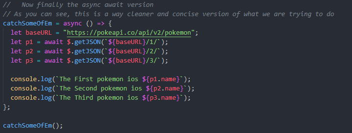

# Async-Await-Examples

## Hi there! And welcome to my repo on Async Await and why it will make your life better as a developer!

### So, What Is Async Await?

#### The Async function declaration defines an asynchronus function, which retuns an AsyncFunction object. An asynchronous function is a function which operates asynchronously via the event loop, using an implicit Promise to return the results. But the syntax and structure of your code using async functions is much more like using standard synchronous functions.

### Let's Look At A Function Using Async Await

### Here it is in action:

### Async Overview

1. The async keyword is part of ES2017
2. You can declare any function in JavaScript as async
3. Async functions always return promises
4. Inside of an async fucntion, you can write code that looks synchronous, even if it isn't

### Let's Look At How Async Functions Always Return a Promise

#### This function looks like it should return our sentence, but instead will return a promise

#### We Can Encapsulate Our Promise in a variable and console log our message from that variable

#### Here it is in our console

### What About Rejections?

#### Inside of async functions, the return value is wrapped in a resolved promise. If you want to reject instead of resolve, simply throw an error inside of the async function

#### Here Is An Example of a Rejected Function:

#### Inside of our console we see:

#### We Can capture this error to log the message instead by using .catch():

#### Now in the console we will see a console log of our error message along with the error:

### The Await Overview

- Inside of an async function, we can use the await keyword
- Await pauses the execution of the async function
- Can await any async operation returning a promise(Ex. other async function!)
- The await keyword waits for promise to resolve & Extracts its resolved value
- It then resumes the async function's execution
- Think of the await keyword like a pause button

#### YOU CANNOT USE AWAIT WITH A NON ASYNC FUNCTION

Incorrect:

Correct:

### Here Is An Example Of A Proper Async Await Function:

#### Here It Is In Action:

### So, Why Is This Important?

#### As you can see from the last example, all the code after await does not run until await is fired. This can be very important if you have code you don't wish to run until something is finished(such as a api call or database query). THINK OF AWAIT AS A PAUSE BUTTON!

## Now Let's See Why Async Await is better than Callbacks or .then()

#### I'm going to show three functions that all do the same thing, but are coded in different ways. The visual difference will be stunning!

#### First: Callbacks

#### Second: .then()

Not as bad as the last one, but still can become messy on larger applications

#### Third: Async Await

#### Here Is Our Code In Action:

#### This is Great! Our code fires sequentially in order just fine! But This Could be Even Better and Faster! Which is important for larger scales applications!

### Here Is Our Better Version!

#### Now you may be asking, "What Is The Difference?" In this code, you wouldn't really be able to tell a difference. They would fire just like the other code did. But let me show you with a different example on why this is truly a faster and better way to code this api call.

#### Here Is Function That Runs Similar to the Non-better Version of the Pokemon Async Await Function

#### Here It Is Running:

You can see that it takes a total of three seconds for all done to console log. This is because it has to await the finish of all three pause functions(1 second each) in order to fire the console log.

#### Now Here Is The Better Version Of This Code:

#### Now Let's Watch Both Run Together To See The Difference!

#### As you can see, the better version only took one second to fire instead of three! Making your actual request not be awaits and instead allow them to fire in parallel with each other improves asynchronicity overall!

# The End

### I really hope you guys enjoyed this and learned something from it! If you could take the time to leave a star that would be appreciated!
